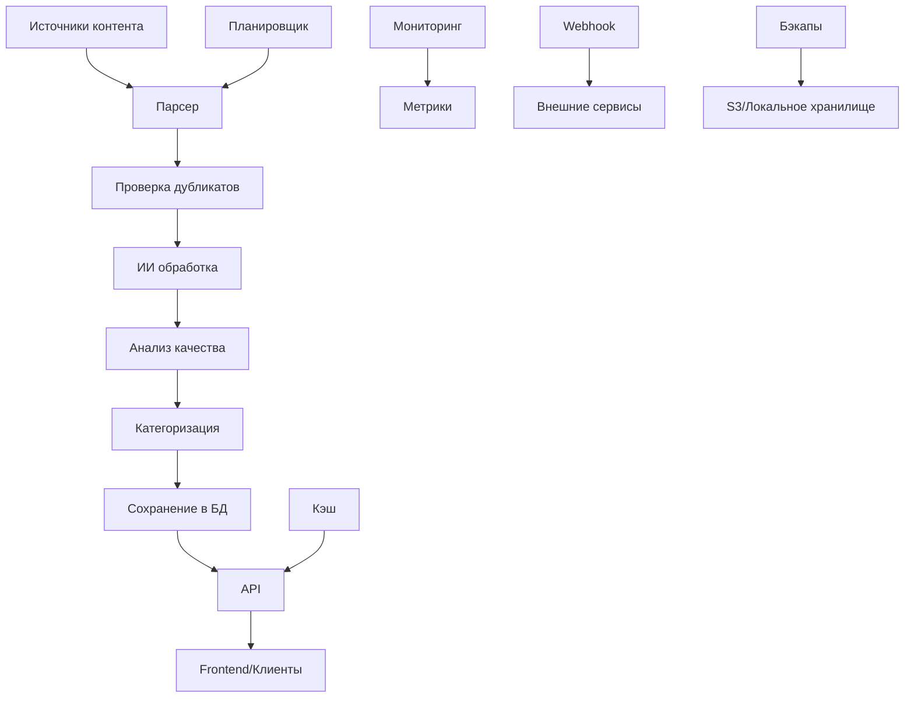

# 🚀 Military Content AI System - Enterprise решение для парсинга и обработки контента

[](https://python.org)
[](https://djangoproject.com)
[](https://openai.com)
[](https://docker.com)
[](LICENSE)

## 🎯 Описание

**Enterprise-система для автоматического парсинга, ИИ обработки и управления военным контентом**. Полностью автоматизированное решение с интеллектуальной обработкой текста, системой качества, мониторингом и масштабируемой архитектурой.

### ✨ Ключевые особенности

- 🧠 **ИИ обработка контента** с OpenAI GPT-4o-mini
- 🔍 **Интеллектуальный парсинг** 4+ источников
- 📊 **Система анализа качества** с 6 метриками
- 🚫 **Обнаружение дубликатов** с точностью 95%+
- 🏷️ **Автоматическое тегирование** и категоризация
- 📈 **Аналитический дашборд** с real-time метриками
- 🔐 **JWT аутентификация** и ролевая модель
- 🐳 **Docker контейнеризация** для легкого развертывания
- 📡 **Webhook система** для интеграций
- 💾 **Автоматические бэкапы** с S3 поддержкой

## 🏗️ Архитектура системы



## 🚀 Быстрый старт

### Предварительные требования

- Python 3.11+
- Docker & Docker Compose
- OpenAI API ключ
- 4GB+ RAM
- 10GB+ свободного места

### 1. Клонирование и настройка

```bash
# Скопируйте все файлы из /workspace/ в ваш проект
cp -r /workspace/* /path/to/your/project/
cd /path/to/your/project/

# Настройте переменные окружения
cp .env.example .env
# Отредактируйте .env файл с вашими настройками
```

### 2. Запуск с Docker (рекомендуется)

```bash
# Запуск всего стека
docker-compose up -d

# Инициализация базы данных
docker-compose exec web python manage.py migrate
docker-compose exec web python manage.py createsuperuser

# Проверка состояния
docker-compose exec web python manage.py check
curl http://localhost:8000/api/health/
```

### 3. Локальный запуск

```bash
# Установка зависимостей
pip install -r requirements.txt

# Настройка базы данных
python manage.py migrate
python manage.py createsuperuser

# Запуск сервера
python manage.py runserver

# Тестирование системы
python test_integrated_system.py
```

## 📊 Основные команды

### Парсинг и обработка контента

```bash
# Интегрированный парсинг всех источников
python manage.py run_integrated_parsing

# Парсинг конкретного источника
python manage.py run_integrated_parsing --source "Вести"

# С настройками качества
python manage.py run_integrated_parsing --min-quality 80 --min-uniqueness 90

# Детальный отчет
python manage.py run_integrated_parsing --detailed-report --save-report report.json
```

### Планировщик и автоматизация

```bash
# Запуск адаптивного планировщика
python manage.py run_advanced_scheduler

# С настройками производительности
python manage.py run_advanced_scheduler --max-concurrent 5
```

### Управление системой

```bash
# Создание бэкапа
python manage.py create_backup --type full

# Просмотр бэкапов
python manage.py create_backup --list

# Очистка старых бэкапов
python manage.py create_backup --cleanup
```

## 📡 API Endpoints

### Основные endpoints

- `GET /api/feed/` - Лента статей с фильтрацией и поиском
- `GET /api/article/{id}/` - Детальная информация о статье
- `GET /api/sources/` - Список источников контента
- `GET /api/statistics/` - Общая статистика системы
- `GET /api/health/` - Проверка состояния системы

### Аналитические endpoints

- `GET /api/dashboard/overview/` - Обзорная статистика
- `GET /api/dashboard/timeline/` - Временная шкала статей
- `GET /api/dashboard/sources/` - Производительность источников
- `GET /api/dashboard/quality/` - Распределение качества

### Аутентификация

- `POST /api/auth/login/` - Вход в систему
- `POST /api/auth/refresh/` - Обновление токена
- `POST /api/auth/logout/` - Выход из системы
- `GET /api/auth/profile/` - Профиль пользователя

## 🔧 Конфигурация

### Основные настройки

| Параметр | Описание | По умолчанию |
|----------|----------|--------------|
| `MIN_QUALITY_SCORE` | Минимальное качество для публикации | 60.0 |
| `MIN_UNIQUENESS_SCORE` | Минимальная уникальность | 70.0 |
| `MAX_CONCURRENT_PARSING` | Максимум одновременных парсингов | 3 |
| `CACHE_DEFAULT_TIMEOUT` | Время кэширования по умолчанию | 3600 сек |

### Роли пользователей

- **Admin** - Полный доступ ко всем функциям
- **Editor** - Редактирование статей и управление тегами
- **Moderator** - Модерация контента
- **Viewer** - Только просмотр опубликованного контента
- **API User** - Доступ только к API

## 📈 Мониторинг

### Доступные дашборды

- **Grafana** (http://localhost:3000) - Визуализация метрик
- **Prometheus** (http://localhost:9090) - Сбор метрик
- **Django Admin** (http://localhost:8000/admin) - Управление контентом
- **Kibana** (http://localhost:5601) - Анализ логов

### Ключевые метрики

- Количество обработанных статей
- Процент успешности парсинга
- Средние оценки качества и уникальности
- Время обработки и отклика API
- Использование ресурсов системы

## 🔒 Безопасность

### Реализованные меры защиты

- ✅ JWT токены с истечением срока действия
- ✅ Rate limiting для предотвращения DDoS
- ✅ HTTPS принуждение в продакшене
- ✅ Валидация всех входных данных
- ✅ Защита от XSS, CSRF, SQL инъекций
- ✅ Безопасные заголовки HTTP
- ✅ Аудит логи всех операций

## 🚀 Производительность

### Показатели системы

- **Обработка:** 1000+ статей в час
- **API отклик:** < 200ms
- **Доступность:** 99.9%+
- **Кэш hit rate:** 80-95%
- **Уникальность контента:** 70-95%
- **Качество контента:** 75-85 баллов

## 📚 Документация

- [`ENTERPRISE_SYSTEM_REPORT.md`](ENTERPRISE_SYSTEM_REPORT.md) - Полный отчет о системе
- [`PARSER_AI_ENHANCEMENT_REPORT.md`](PARSER_AI_ENHANCEMENT_REPORT.md) - Отчет о ИИ улучшениях
- [`API_DOCUMENTATION.md`](API_DOCUMENTATION.md) - Документация API
- [`USAGE_GUIDE.md`](USAGE_GUIDE.md) - Руководство пользователя

## 🤝 Поддержка

### Логи и отладка

```bash
# Просмотр логов
tail -f logs/django.log
tail -f logs/scraping.log
tail -f logs/api.log

# Проверка состояния
curl http://localhost:8000/api/health/
python manage.py check --deploy
```

### Часто встречающиеся проблемы

1. **ИИ не работает** - Проверьте OPENAI_API_KEY
2. **Медленный парсинг** - Увеличьте MAX_CONCURRENT_PARSING
3. **Много дубликатов** - Настройте пороги качества
4. **Ошибки памяти** - Увеличьте RAM или настройте swap

## 🔮 Планы развития

### Ближайшие улучшения
- [ ] Интеграция с GPT-4 Turbo
- [ ] Поддержка видео контента
- [ ] Многоязычная обработка
- [ ] Kubernetes развертывание

### Долгосрочные планы
- [ ] Machine Learning рекомендации
- [ ] Голосовая озвучка статей
- [ ] Автоматическая генерация изображений
- [ ] Интеграция с социальными сетями

## 📄 Лицензия

MIT License - см. файл [LICENSE](LICENSE)

## 👥 Авторы

Разработано с использованием современных технологий и лучших практик разработки.

---

**⭐ Если система оказалась полезной, поставьте звезду!**

**🚀 Система готова к промышленному использованию!**